# DSO202 — Practical 2 Report
## Implementing Persistent Storage for a Stateful Application in Kubernetes

---

## 1. Objective

This practical implements persistent storage in Kubernetes and uses it to run a stateful application. It covers Unit I — PersistentVolumes (PV), PersistentVolumeClaims (PVC), StorageClasses, static and dynamic provisioning, and resource quotas extended to storage — and Unit II — the StatefulSet controller, headless Services, and controlled rolling updates.

The practical builds a three-node `kind` cluster and works through eight stages:

1. Cluster and storage-layer setup
2. Static provisioning (a hand-created PersistentVolume)
3. Dynamic provisioning (a claim that triggers automatic volume creation)
4. A deliberately broken configuration — a Deployment sharing one PVC across three replicas — to observe why a Deployment is unsuitable for stateful workloads
5. A StatefulSet (`webnote`) demonstrating stable identity, per-Pod storage, and per-Pod DNS
6. Scaling and a partitioned rolling update of the StatefulSet
7. A real stateful application — a PostgreSQL StatefulSet used by the Task Tracker application from Assignment 1
8. Cleanup, and observation of what a reclaim policy actually protects

---

## 2. Environment

| Component | Value |
|---|---|
| Host OS | Kali Linux, kernel `6.16.8+kali-amd64`, Debian GNU/Linux 13 (trixie) base |
| Container runtime | Docker (containerd `2.3.1` as reported by `kubectl get nodes -o wide`) |
| kind | Used to create a 3-node cluster (`dso202-p2`) from `cluster/kind-cluster.yaml` |
| Kubernetes | v1.36.1 (node image `kindest/node:v1.36.1`) |
| kubectl | Client compatible with server v1.36.1 |
| PostgreSQL image | `postgres:18-alpine`, as specified in Listing 16 |
| Namespace | `dso202-practical-02`, set as the default context namespace for the session |
| Host storage path | `/tmp/dso202-p2-storage`, bind-mounted into `worker-node-1` at `/mnt/dso202-static` |

The node-name patches in `cluster/kind-cluster.yaml` applied successfully — `kubectl get nodes` returned `control-plane`, `worker-node-1`, `worker-node-2` rather than kind's default Docker container names, so the fallback configuration (Listing 1B) was **not** required.

---

## 3. Procedure and Observations

### Stage 0 — Host directory for static storage

The host directory that Stage 2's static PersistentVolume depends on was created before the cluster, since `kind` mounts it into a node at cluster-creation time.

```
mkdir -p /tmp/dso202-p2-storage
ls -ld /tmp/dso202-p2-storage
```

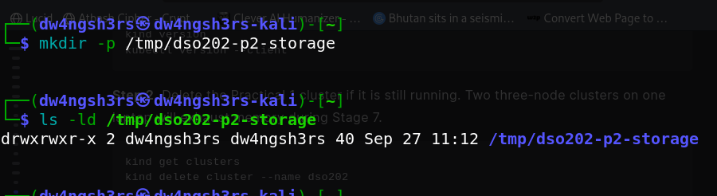

The directory exists and is owned by the invoking user, confirming it is ready to be bind-mounted.

### Stage 1 — Cluster creation and the storage layer

`kind create cluster --config cluster/kind-cluster.yaml` produced a three-node cluster, and `kubectl get nodes -o wide` confirmed all three nodes reached `Ready` with the custom names from the kubeadm patches. `docker ps` confirmed the matching container names (`dso202-p2-control-plane`, `dso202-p2-worker`, `dso202-p2-worker2`), and `docker exec dso202-p2-worker ls -ld /mnt/dso202-static` confirmed the host bind mount landed on the correct node.

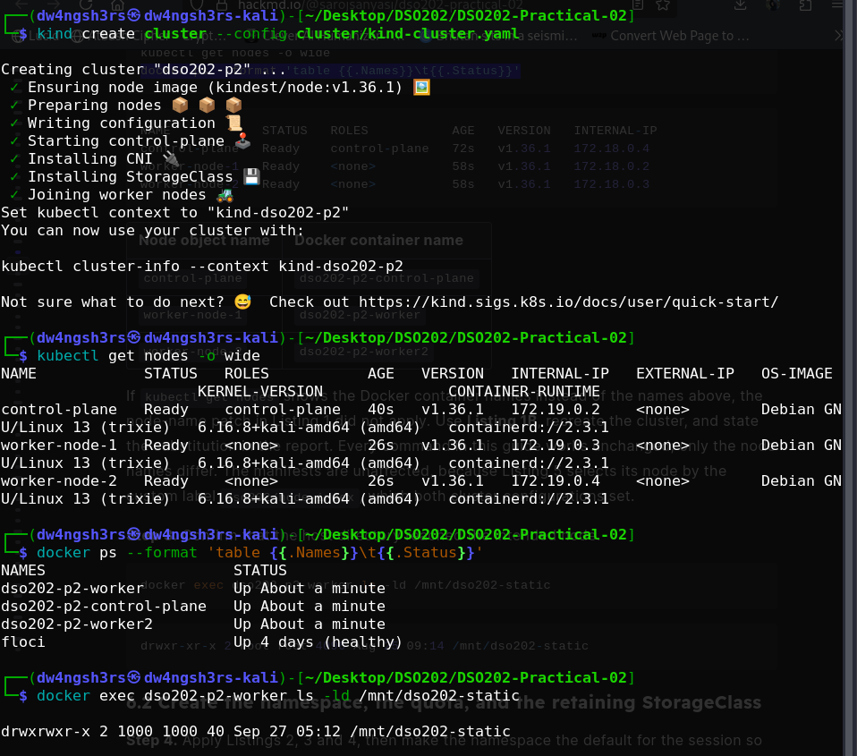

After applying the namespace, quota and StorageClass manifests (Listings 2–4), `kubectl get storageclass` showed both classes installed by this practical: `standard` (the cluster default, `reclaimPolicy: Delete`) and `dso202-retain` (`reclaimPolicy: Retain`), both using the `rancher.io/local-path` provisioner with `VOLUMEBINDINGMODE: WaitForFirstConsumer` and `ALLOWVOLUMEEXPANSION: false`.

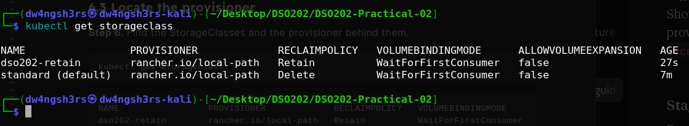

**Observation:** the cluster ships with a working storage provisioner out of the box (`Installing StorageClass` in the creation log), which is a `kind` convenience — a cluster built by hand with `kubeadm` would have neither a CNI plugin nor a storage provisioner until an administrator added them.

### Stage 2 — Static provisioning

Applying Listing 5 created `pv-web-static` in phase `Available`, backed by the host path `/mnt/dso202-static/pv-web-static` and constrained by `nodeAffinity` to the node labelled `dso202/node-index: "1"`. Applying Listing 6 immediately bound the claim (`pvc-web-static`, STATUS `Bound`) — no provisioner was involved, since `storageClassName: manual` names no real StorageClass object; the control plane simply matched an `Available` PV whose class name, capacity and access modes satisfied the claim.

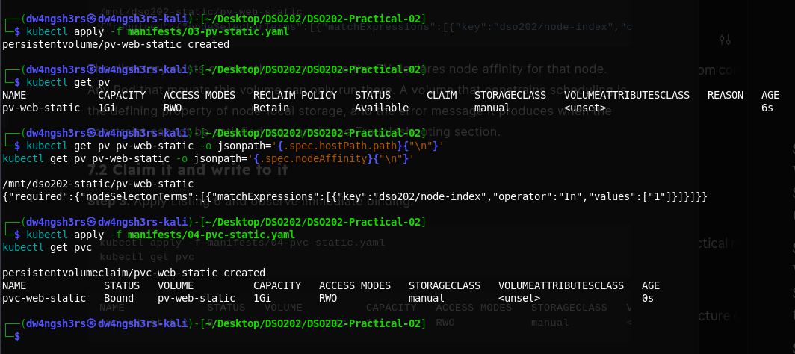

After the writer Pod started and appended its start line, the file was read both from inside the container (`kubectl exec ... cat /data/ledger.txt`) and directly from the host (`cat /tmp/dso202-p2-storage/pv-web-static/ledger.txt`).

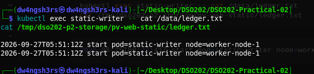

**Observation:** both reads returned the same content — the same directory on the node is exposed through the container mount and through the host filesystem, which is the entire mechanism of a hostPath-backed static volume.

The Pod and claim were then deleted while the PV's `persistentVolumeReclaimPolicy` was `Retain`:

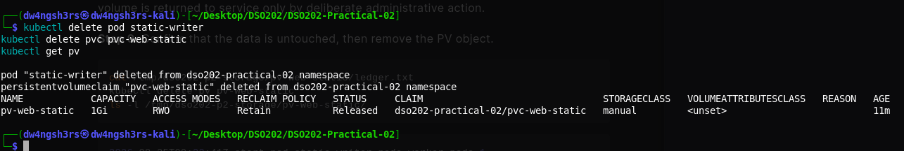

**Observation:** the PV entered phase `Released`, not `Available`, and the `CLAIM` column still names the deleted claim (`dso202-practical-02/pvc-web-static`). Kubernetes will not silently hand a volume that may still hold data to the next claim that requests storage — a `Released` volume is returned to service only by deliberate administrative action, which is exactly the point Stage 8 revisits.

### Stage 3 — Dynamic provisioning

Applying Listing 8 (a claim with no Pod) left `dynamic-data` in phase `Pending`. `kubectl describe pvc dynamic-data | tail -n 6` showed why: the `standard` class uses `WaitForFirstConsumer`, so the event log reads `waiting for first consumer to be created before binding`.

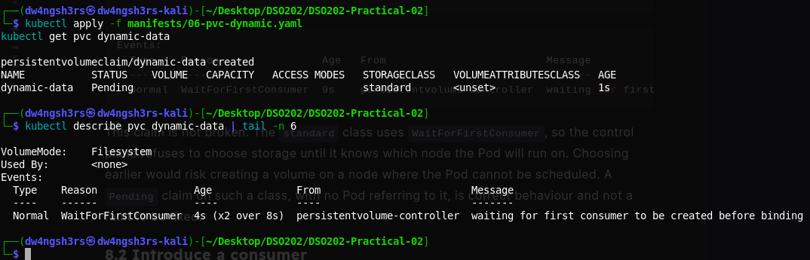

Once Listing 9's Pod was applied, the claim bound and a PersistentVolume was created automatically (visible by its `pvc-<uuid>` naming). `kubectl exec dynamic-writer -- df -h /data` was then run to check enforcement of the requested size:

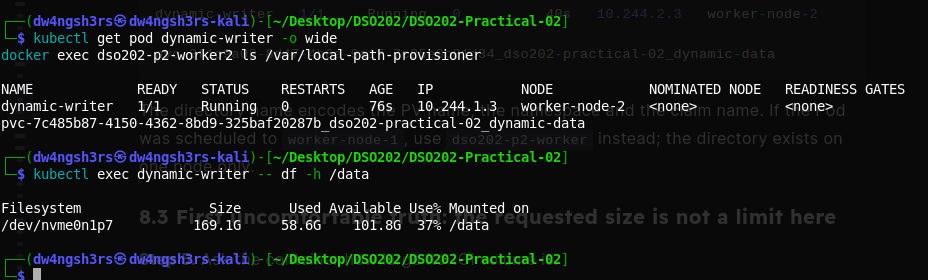

**Observation:** the claim requested 1Gi, but `df -h /data` reports the full node filesystem (~169G). The `rancher.io/local-path` provisioner records the requested capacity in the API and does not enforce it — a real CSI driver on a managed cloud cluster would provision and enforce a disk of exactly the requested size.

An attempt to grow the claim was rejected outright:

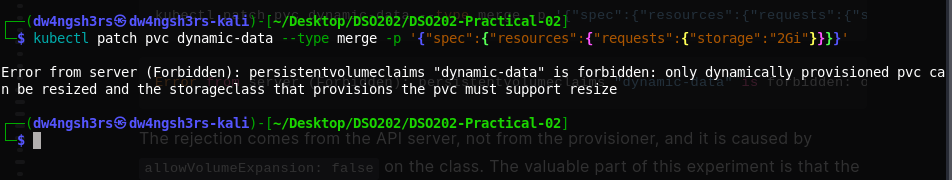

**Observation:** the rejection (`Error from server (Forbidden)`) comes from the API server itself, driven by `allowVolumeExpansion: false` on the `standard` class — not from the provisioner. The choice of StorageClass is a decision about a workload's future, made before any data exists.

### Stage 4 — Anti-pattern: a Deployment sharing one PVC

Applying Listing 10 rolled out a Deployment with three replicas sharing a single `ReadWriteOnce` claim.

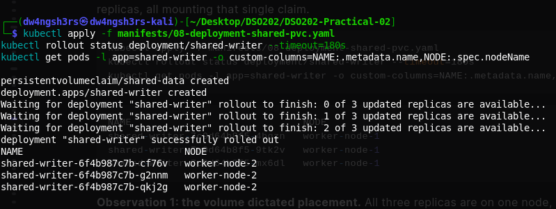

**Observation 1 — placement was dictated by storage.** All three replicas were scheduled onto `worker-node-2`, although the Deployment expresses no node preference at all. The claim was bound to a volume that physically exists on one node, so the scheduler had no choice but to place every replica there.

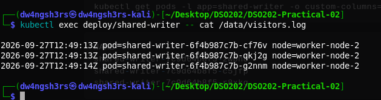

**Observation 2 — one shared file, not three private ones.** All three replicas appended to the same `visitors.log` on the same volume. A stateless web tier can tolerate this; a database writing to a shared data directory from multiple processes would corrupt it. Nothing in the Deployment specification can give each replica its own volume, because the claim is named once in the Pod template and every replica reuses that template.

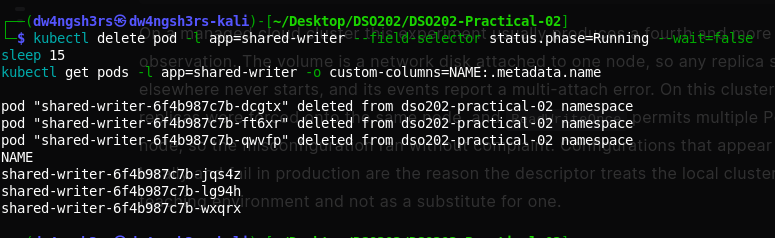

**Observation 3 — no identity survives.** After the running replicas were deleted, `kubectl get pods` returned entirely new name suffixes. There is no way for anything — an application, a monitoring system, another Pod — to refer to "the first replica" and mean the same process across a restart. A replicated database, whose members must find each other by a durable name, cannot be built on this controller. The Deployment and its claim were removed before proceeding to Stage 5.

### Stage 5 — The `webnote` StatefulSet

The headless Service (Listing 11) was applied first, so per-Pod DNS names would exist from the moment Pods became ready. Applying the StatefulSet (Listing 12) and watching `kubectl get pods -l app=webnote -w` showed strictly ordered creation:

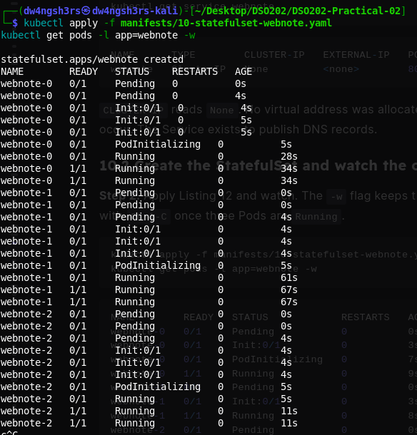

**Observation:** `webnote-1` was not created until `webnote-0` was `Running` and `Ready`, and `webnote-2` waited for `webnote-1` in turn — the default `OrderedReady` Pod management policy.

`kubectl get pvc -l app=webnote` showed one claim generated per ordinal from the single `volumeClaimTemplate`:

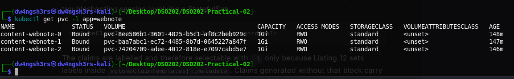

**Observation:** `content-webnote-0`, `content-webnote-1` and `content-webnote-2` are three independent, separately named claims — a single template produced per-ordinal storage, the exact capability a Deployment lacks.

With the client Pod running, both DNS forms were resolved:

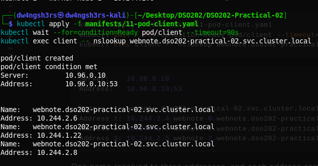

**Observation:** the single name `webnote.dso202-practical-02.svc.cluster.local` resolved to three addresses, each one labelled with the owning Pod's own DNS name — the behaviour of a headless Service (`clusterIP: None`), as opposed to a normal ClusterIP Service which would return one virtual address and hide the individual Pods.

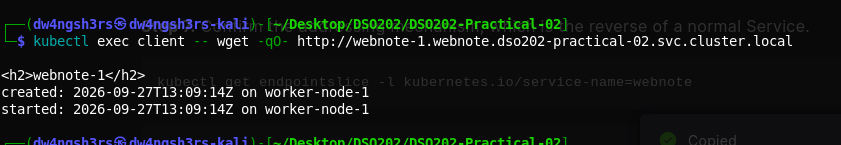

**Observation:** fetching the page from `webnote-1` specifically returned content written by that Pod's own init container onto its own volume (`content-webnote-1`), addressed by its individual DNS name rather than through the load-balanced Service — confirming each ordinal owns genuinely separate storage.

### Stage 6 — Scaling and a partitioned rolling update

Scaling down from four replicas to two showed strict descending termination order:

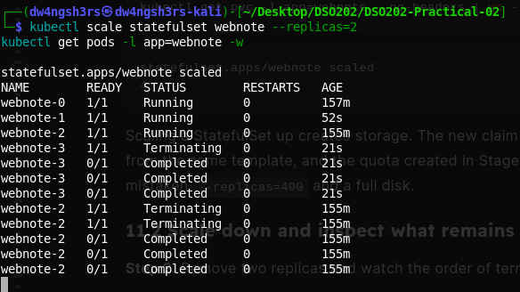

**Observation:** `webnote-3` (the highest ordinal) reached `Terminating` and completed before `webnote-2` began terminating — the reverse of the creation order in Stage 5.

Despite two Pods remaining, all four generated claims were still present:

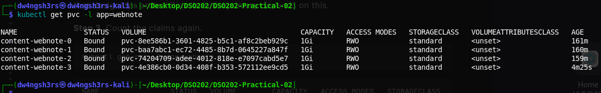

**Observation:** `content-webnote-0` through `content-webnote-3` all remained `Bound`. Scaling down removes Pods, not their storage — `whenScaled: Retain` (the field's default) means the data of a removed replica is preserved until a deliberate cleanup step removes the claim.

Scaling back up to three replicas returned the original `content-webnote-2` data to `webnote-2`:

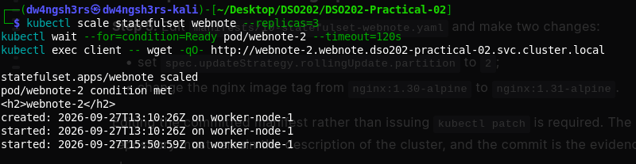

**Observation:** the `created:` timestamp matches the value first written in Stage 5, and a new `started:` line was appended — ordinal 2 reclaimed the exact volume it owned before, by name. Identity, not the Pod's lifetime, is what links a replica to its data.

A partitioned rollout was then performed by editing the committed manifest — setting `partition: 2` and changing the container image to `nginx:1.31-alpine`:

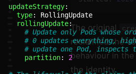
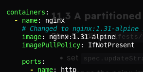
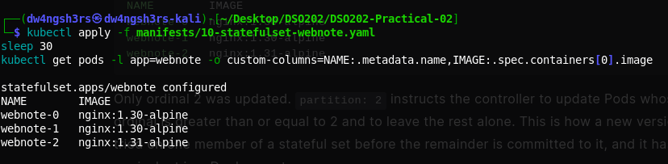

**Observation:** with `partition: 2`, only Pods whose ordinal is `>= 2` were updated. `webnote-2` moved to `nginx:1.31-alpine` while `webnote-0` and `webnote-1` stayed on `nginx:1.30-alpine` — a new version tested on one member of the set before the remainder is committed to it, which has no equivalent in a Deployment rollout.

Setting `partition` back to `0` completed the rollout across the remaining ordinals:

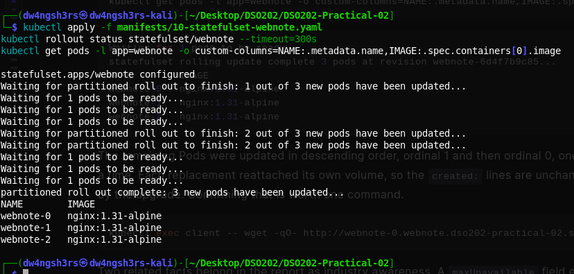

**Observation:** `kubectl rollout status` reported the rolling update complete, and every remaining Pod was updated in descending ordinal order (ordinal 1, then ordinal 0), consistent with the StatefulSet's general update order.

Finally, the whole StatefulSet object was deleted and reapplied:

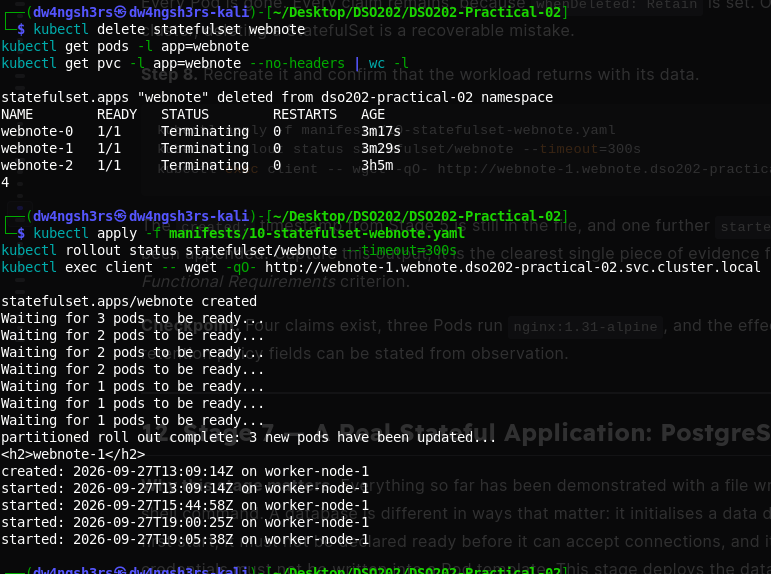

**Observation:** all three Pods were removed by the delete, and the claim count (`4`) was unchanged throughout. After reapplying the manifest, `webnote-1`'s page still carried its **original** Stage 5 `created:` timestamp, with several new `started:` lines appended from every restart since. Deleting a StatefulSet on this cluster is a recoverable mistake, because `whenDeleted: Retain` is set.

### Stage 7 — A real stateful application: PostgreSQL

The Secret, the two Services (headless and ClusterIP), and the PostgreSQL StatefulSet (Listings 14–16) were applied. `kubectl get pods -l app=postgres -w` showed a visible gap between the container reaching `Running` and passing its readiness probe (`1/1`); `kubectl logs` confirmed the database completed startup and began accepting connections, and `kubectl get pv` at this point showed all six volumes present across both StorageClasses.

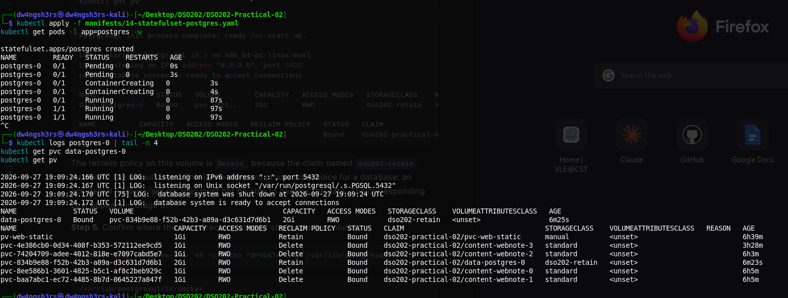

**Observation:** `data-postgres-0` bound to a 2Gi volume on the `dso202-retain` class rather than `standard` — the deliberate production choice for a database, so that an accidental `kubectl delete pvc` cannot destroy the data.

A table was created and rows inserted directly against the running database:

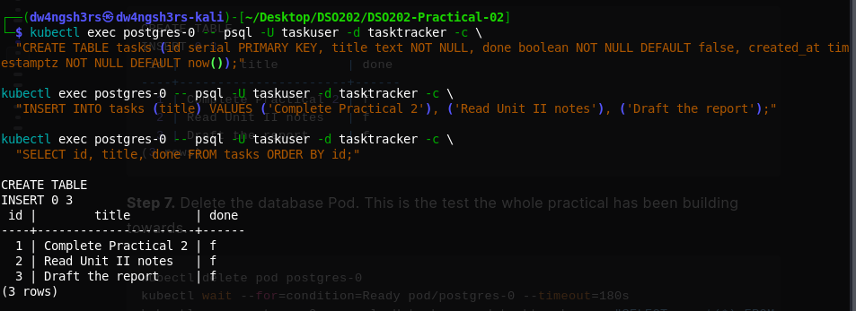

The database Pod was then deleted outright — the central test the whole practical builds toward:

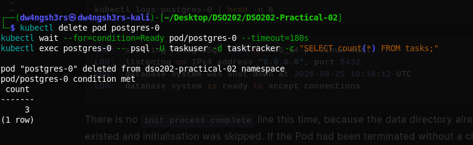

**Observation:** `postgres-0` was deleted, its replacement reached `Ready`, and `SELECT count(*) FROM tasks` still returned `3` — rows written by a process that no longer exists, read back through a Pod that did not exist when they were written. This is the direct proof that the volume, not the Pod, is what holds the data.

Both PostgreSQL Service names were confirmed resolvable:

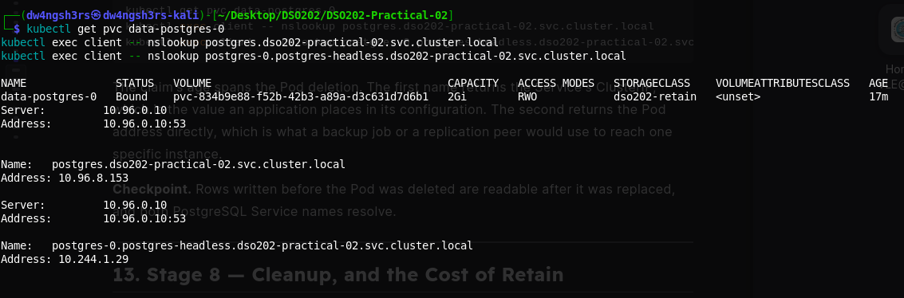

**Observation:** `postgres.dso202-practical-02.svc.cluster.local` resolved to the Service's stable ClusterIP (`10.96.8.153`) — the address an application's connection string would use — while `postgres-0.postgres-headless.dso202-practical-02.svc.cluster.local` resolved directly to the Pod's own address, the form a backup job or replication peer would use to reach one specific instance.

### Stage 8 — Cleanup and the cost of Retain

With six claims present across the namespace, `kubectl delete pvc --all` was run and the PV list inspected immediately afterward:

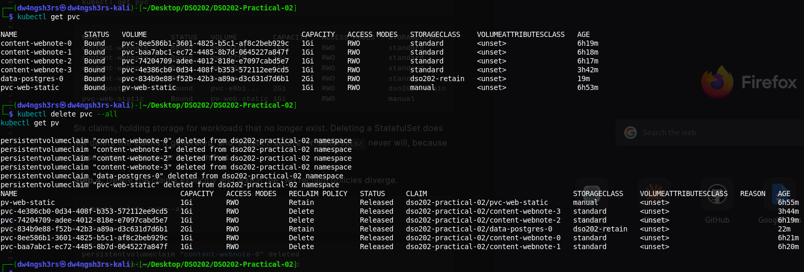

**Observation:** all six volumes appeared as `Released` at the moment this was captured, including the four on the `standard` class, whose `reclaimPolicy` is `Delete`. This reflects the `local-path-provisioner`'s cleanup being asynchronous — a `Delete`-policy volume passes through `Released` before the provisioner's background deleter actually removes the PV object and its backing directory, whereas the two `dso202-retain` volumes (`pv-web-static`'s equivalent and `data-postgres-0`'s volume) remain `Released` indefinitely, because nothing will ever delete them automatically. This distinction is discussed further in Section 4, Question 8.

The cluster was then deleted entirely:

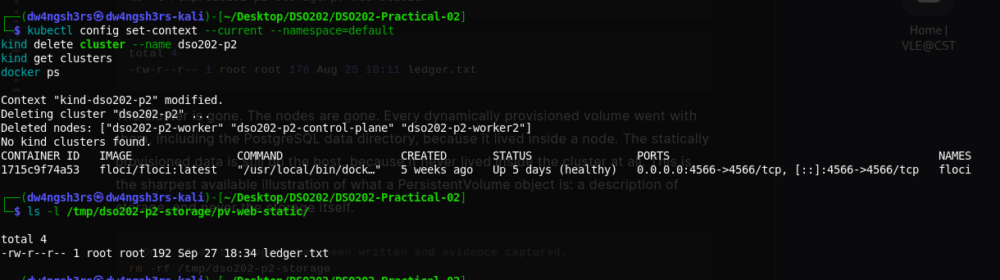

**Observation:** `kind get clusters` reported no clusters and `docker ps` showed no `dso202-p2-*` containers, while `ledger.txt` was still present and intact under `/tmp/dso202-p2-storage/pv-web-static/` on the host. Every dynamically provisioned volume — including the entire PostgreSQL data directory — was destroyed along with the cluster's nodes, because that storage lived inside a node's container filesystem. The statically provisioned data survived, because it never lived inside the cluster at all. This asymmetry is the clearest possible illustration that a PersistentVolume object is a *description* of storage, never the storage itself.

---

## 4. Analysis

**1. Why did the Stage 3 claim stay `Pending` while the Stage 2 claim bound immediately?**
The deciding field is `volumeBindingMode` on the StorageClass. Stage 2's claim named `storageClassName: manual`, which is not a real StorageClass object at all — no binding mode applies, and the claim matched an already-`Available` PV instantly. Stage 3's claim used the `standard` class, whose `volumeBindingMode: WaitForFirstConsumer` deliberately defers the binding decision until a Pod that needs the claim has been scheduled. The reasoning is that choosing a node for the storage before the Pod is scheduled risks provisioning a volume where the Pod can never run; waiting means the volume is always created on the node the consuming Pod actually lands on.

**2. Why did Stage 2's data survive claim deletion while Stage 3's did not?**
The field is `reclaimPolicy`, and in both cases it is carried by the object describing the storage rather than by the claim. In Stage 2, `persistentVolumeReclaimPolicy: Retain` was written directly onto the hand-created PersistentVolume by whoever authored Listing 5 (the "administrator" role). In Stage 3, the PV was created automatically by the provisioner and inherited `reclaimPolicy: Delete` from the `standard` StorageClass — a decision made by whoever created that class, not by the person who later wrote the claim. Nothing in a PVC can override a class's reclaim policy.

**3. Why were all three Stage 4 replicas scheduled onto one node?**
The Deployment's Pod template names a single PVC (`shared-data`), and that claim is bound to exactly one PersistentVolume, which the `local-path-provisioner` created as a directory on one specific node. `ReadWriteOnce` volumes can only be mounted by Pods on that one node, so the scheduler has no other option for any replica that needs the claim — the storage decision silently overrides the Deployment's freedom to place Pods anywhere. On a managed cloud cluster the equivalent volume would be a zonal network disk, attachable to only one node at a time; a replica scheduled to a different node would never start, and its events would report a multi-attach error rather than silently succeeding as it did here.

**4. FQDN of the second replica of `webnote`, and every object required for it to resolve.**
`webnote-1.webnote.dso202-practical-02.svc.cluster.local`. Resolving it requires: the Pod `webnote-1` itself (existing and, for it to appear in DNS, `Ready`, since `publishNotReadyAddresses` is `false`); the headless Service `webnote` (`clusterIP: None`), whose name supplies the `<service>` segment and which the StatefulSet's `serviceName` field must name exactly; and the StatefulSet `webnote`, whose ordinal numbering produces the `<pod>` segment and whose `serviceName` link is what causes the per-Pod DNS record to be published at all.

**5. Claims through the scale 4 → 2 → 3 sequence.**
Scaling from three to four created a fourth claim, `content-webnote-3`, from the `volumeClaimTemplate`. Scaling down from four to two removed Pods `webnote-3` and `webnote-2` but left all four claims `Bound` — governed by `persistentVolumeClaimRetentionPolicy.whenScaled`, whose default is `Retain`. Scaling back up to three did not create a new claim for ordinal 2; it reattached the existing `content-webnote-2`, matched by name. The companion field, `whenDeleted`, governs what happens to claims when the whole StatefulSet object is removed (also defaulting to `Retain`, exercised later in Stage 6's delete/recreate step).

**6. Why Listing 16 mounts the volume at `/var/lib/postgresql` rather than at the data directory.**
From PostgreSQL 18 onward, the official image keeps its data directory in a version-numbered subdirectory (`/var/lib/postgresql/18/docker`), one level below the path Listing 16 mounts. This is deliberate: a freshly provisioned volume may already contain entries placed there by the storage driver, and `initdb` refuses to initialise a directory that is not already empty. Mounting the volume directly at the data directory would therefore fail with an error that the data directory is not empty on any storage backend that leaves such entries behind — a fault that would appear intermittently depending on the provisioner, which is the worst kind of failure to debug. Mounting one level above avoids the problem entirely, regardless of what the storage layer places at the mount point.

**7. Two things a StatefulSet does not provide for a database.**
First, replication: three replicas of a StatefulSet produce three independent volumes holding three unrelated sets of data (demonstrated indirectly in Stage 5, where each `webnote` ordinal held entirely separate content) — actual replication is the job of the database software itself, or of a Kubernetes **Operator** written for that specific database (Unit II 2.4). Second, backup: a retained volume that survives Pod deletion is not a backup, because a single mistaken `kubectl delete pvc` or `kubectl delete pv` can still destroy it — a real backup requires copying the data somewhere outside the cluster's control, which Stage 8's `pg_dump` captures for exactly this reason.

**8. Why the two volumes reported `Released` rather than `Available` after their claims were deleted, and what returns them to service.**
Both volumes (the static web volume and the PostgreSQL data volume) carry `persistentVolumeReclaimPolicy: Retain`. Kubernetes will not silently make a volume that may still hold a previous workload's data available to an unrelated new claim — the `Released` phase exists precisely to force a human decision. To return the storage to service, an administrator must inspect the data, decide what to do with it, and then either delete the PV object outright (as Stage 2 and Stage 8 both did) so the underlying directory can be reused by a fresh PV, or manually clear the `claimRef` field on the PV so it becomes `Available` again for a new claim to bind to without recreating the object.

---

## 5. Reflection

Stage 4 was the most useful part of the practical because I saw a three-replica Deployment run successfully even with shared storage and no fixed Pod identity. This helped me understand why StatefulSets are important for stateful applications.

In Stage 8, all six PVs briefly showed `Released` after deleting the PVCs. I learned that the `Delete` volumes are cleaned up shortly after, while the `Retain` volumes remain. If I repeated the practical, I would run `kubectl get pv` again after a few seconds to clearly show this cleanup process.